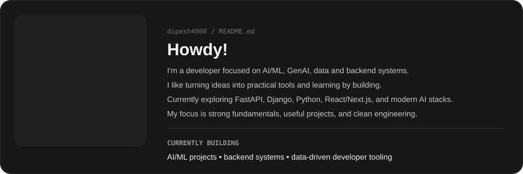
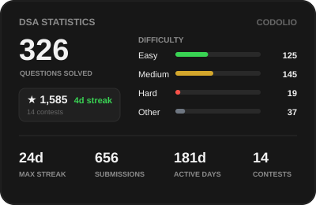
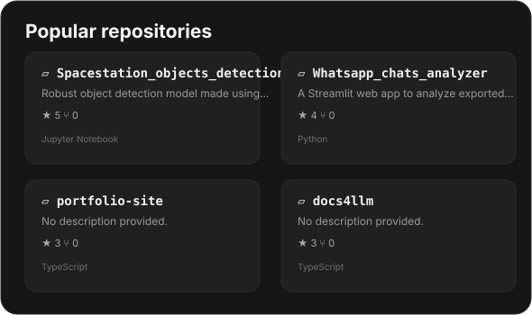
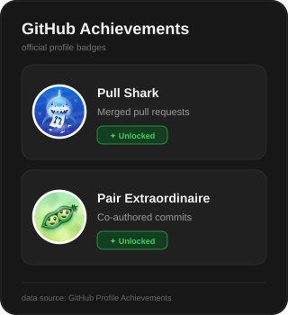
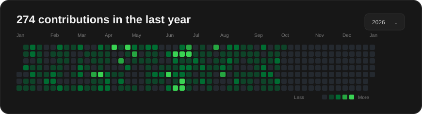

<!--
  Dipesh Kumar — GitHub Profile README
  Dashboard-style layout inspired by the supplied reference.

  IMPORTANT:
  - The existing Codolio DSA card is referenced but not generated here.
  - The existing DSA workflow should remain untouched.
  - profile-dashboard.yml only refreshes the cards it owns.
-->

  

<!-- Row 1: DSA stats (left) | GitHub Stats card (right) -->
<table width="100%" cellspacing="0" cellpadding="0" border="0">
  <tr>
    <td width="38%" valign="top" align="center">
      
    </td>
    <td width="2%"></td>
    <td width="60%" valign="top" align="center">
      
    </td>
  </tr>
</table>

 

<!-- Row 2: Popular & Pinned Repos (left) | GitHub Achievements (right) -->
<table width="100%" cellspacing="0" cellpadding="0" border="0">
  <tr>
    <td width="66%" valign="top" align="center">
      
    </td>
    <td width="2%"></td>
    <td width="32%" valign="top" align="center">
      
    </td>
  </tr>
</table>

 

<!-- Row 3: Contribution Graph (full width) -->

  

 

